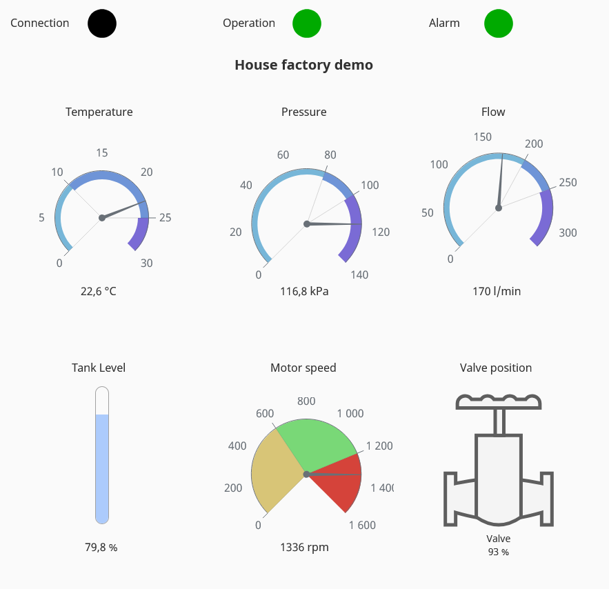

# Ignition Integration

This folder contains the Ignition part of the **House Factory Modbus MQTT Demo**.

The goal is to show how simulated industrial data from the Raspberry Pi / Docker demo can be consumed and visualized in Ignition.

## Data flow

```text
Python Modbus/MQTT simulator
        |
        | Modbus TCP
        v
Ignition OPC UA Server / Modbus device
        |
        v
Ignition tags
        |
        v
Perspective dashboard
```

The simulator also publishes the same process values to MQTT using a UNS-style topic structure:

```text
Python simulator -> Mosquitto MQTT broker -> UNS-style topics
```

This allows the demo to represent both common industrial data paths:

```text
Modbus TCP -> Ignition tags -> Perspective dashboard
MQTT -> UNS-style namespace -> future MQTT/Ignition integration
```

## Folder structure

```text
ignition/
├── README.md
├── project-export/
│   └── house-factory-perspective.zip
├── tag-export/
│   └── house-factory-tags.json
└── screenshots/
    └── perspective-dashboard.png
```

## Contents

### `project-export/`

Contains an Ignition project export with Perspective resources.

The project export includes the demo Perspective view used to visualize House Factory process values.

Typical exported resources:

* Perspective page configuration
* Perspective session properties
* project properties
* Perspective views

### `tag-export/`

Contains an Ignition tag export for the House Factory demo.

The tag structure includes:

* OPC tags reading raw Modbus holding registers from the simulated factory device
* expression tags for scaled engineering values
* status tags such as alarm, running state and heartbeat

The exported OPC item paths use the local demo device name:

```text
[Raspberry_factory]
```

This is only a demo device name used inside Ignition.

### `screenshots/`

Contains screenshots of the Perspective dashboard and other relevant Ignition views.

Screenshots are included to make the demo understandable without requiring the project to be imported first.

## Tag structure

The demo uses raw Modbus values and scaled engineering values.

Example raw OPC tags:

```text
Temperature_raw
Pressure_raw
TankLevel_raw
MotorSpeed
ValvePosition
Flow
Alarm
Running
Heartbeat
```

Example expression tags:

```text
Temperature = Temperature_raw / 10
Pressure    = Pressure_raw / 10
TankLevel   = TankLevel_raw / 10
```

This represents a typical industrial pattern where raw PLC/Modbus values are scaled into engineering units inside SCADA.

## Example tag mapping

| Ignition tag      | Source                  | Meaning                  |
| ----------------- | ----------------------- | ------------------------ |
| `Temperature_raw` | Modbus holding register | raw temperature value    |
| `Temperature`     | expression tag          | scaled temperature in °C |
| `Pressure_raw`    | Modbus holding register | raw pressure value       |
| `Pressure`        | expression tag          | scaled pressure in kPa   |
| `TankLevel_raw`   | Modbus holding register | raw tank level value     |
| `TankLevel`       | expression tag          | scaled tank level in %   |
| `MotorSpeed`      | Modbus holding register | motor speed in rpm       |
| `ValvePosition`   | Modbus holding register | valve position in %      |
| `Flow`            | Modbus holding register | flow in l/min            |
| `Alarm`           | Modbus holding register | alarm status             |
| `Running`         | Modbus holding register | running status           |
| `Heartbeat`       | Modbus holding register | changing heartbeat value |

## Perspective dashboard

The Perspective dashboard visualizes the live House Factory process values.

The dashboard is intended as a simple industrial HMI / IIoT visualization layer for:

* current process values
* equipment status
* alarm state
* heartbeat / connection check
* basic process overview

Example screenshot:

```md

```

## Importing into Ignition

To use the demo in Ignition:

1. Start the House Factory simulator.
2. Make sure the Modbus TCP server is reachable from the Ignition Gateway.
3. In Ignition, configure a Modbus TCP device matching the simulator.
4. Import the tag export from `tag-export/`.
5. Import the Perspective project resources from `project-export/`.
6. Open the Perspective view and verify that live values are updating.

## Notes

The demo simulator exposes Modbus TCP values on port:

```text
5020
```

When running locally, the simulator is available at:

```text
localhost:5020
```

When running on a Raspberry Pi or another Linux machine, use the device IP address:

```text
RaspberryPi_IP:5020
```

The MQTT side of the demo publishes values under:

```text
uns/v1/house-factory/line-01
```

## Security note

This is a local lab and portfolio demo.

Do not expose the Modbus TCP server, MQTT broker, or Ignition Gateway directly to the internet.

For real deployments, use:

* authentication
* TLS where applicable
* firewall rules
* VPN access
* network segmentation
* proper user permissions
* secure credential management

## Purpose

This Ignition integration demonstrates how simulated shopfloor data can be converted into SCADA/IIoT visualization.

It connects the House Factory demo to concepts used in industrial environments:

```text
Modbus TCP
Ignition OPC UA Server
Ignition tags
Perspective dashboard
MQTT / UNS-style topic structure
```

The folder is part of a broader IIoT demo showing real-time connectivity between simulated shopfloor systems and digital platforms.
