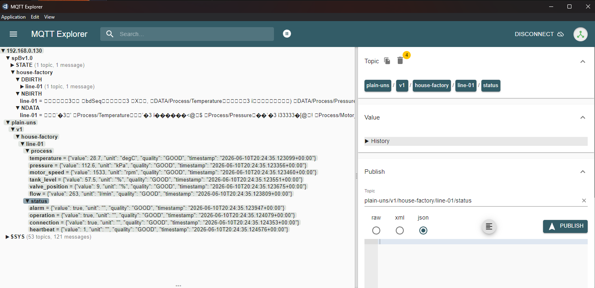

# House Factory Modbus MQTT Demo

This project is a small IIoT demo for a Raspberry Pi, Linux machine, or Docker environment.

It simulates a simple factory line by exposing process values over **Modbus TCP** and publishing the same values to an **MQTT broker** using a simple UNS-style topic structure.

The project also includes an **Ignition integration** with exported tags and Perspective resources for visualizing the simulated process data.

## Industrial data flow

The demo represents two common IIoT / OT data paths.

### Modbus TCP to Ignition

```text
Python factory simulator
        |
        | Modbus TCP
        v
Ignition OPC UA Server / Modbus device
        |
        v
Ignition tags
        |
        v
Perspective dashboard
```

### MQTT / UNS-style publishing

```text
Python factory simulator
        |
        | MQTT
        v
Mosquitto MQTT broker
        |
        v
UNS-style MQTT topic structure
```

The project can be run in two ways:

```text
1. Directly on Raspberry Pi / Linux with Python and Mosquitto installed
2. With Docker Compose using separate containers for Mosquitto and the Python simulator
```

## Features

* Simulated factory process values
* Modbus TCP server
* MQTT publishing
* UNS-style MQTT topics
* JSON payloads with value, unit, quality and timestamp
* Raspberry Pi / Linux deployment
* Docker Compose deployment
* Local Mosquitto broker configuration example
* Environment-variable configuration for Docker and local use
* Ignition tag export
* Ignition Perspective project resources
* Perspective dashboard documentation
* Modbus raw-value scaling in Ignition expression tags

## Project structure

```text
house-factory-modbus-mqtt/
├── README.md
├── src/
│   └── modbus_factory.py
├── mosquitto/
│   └── house-factory.conf
├── ignition/
│   ├── README.md
│   ├── project-export/
│   ├── tag-export/
│   │   └── house-factory-tags.json
│   └── screenshots/
├── screenshots/
│   └── mqtt-explorer-topics.png
├── requirements.txt
├── Dockerfile
├── docker-compose.yml
└── .dockerignore
```

## Simulated process values

The script simulates several factory/process signals:

| Signal         | Modbus register | MQTT path                | Unit    |
| -------------- | --------------: | ------------------------ | ------- |
| Temperature    |        HR 40001 | `process/temperature`    | degC    |
| Pressure       |        HR 40002 | `process/pressure`       | kPa     |
| Motor speed    |        HR 40003 | `process/motor_speed`    | rpm     |
| Tank level     |        HR 40004 | `process/tank_level`     | %       |
| Valve position |        HR 40005 | `process/valve_position` | %       |
| Flow           |        HR 40006 | `process/flow`           | l/min   |
| Alarm          |        HR 40007 | `status/alarm`           | boolean |
| Running status |        HR 40008 | `status/operation`       | boolean |
| Heartbeat      |        HR 40009 | `status/heartbeat`       | counter |

## MQTT topic structure

Base topic:

```text
uns/v1/house-factory/line-01
```

Example topics:

```text
uns/v1/house-factory/line-01/process/temperature
uns/v1/house-factory/line-01/process/pressure
uns/v1/house-factory/line-01/process/motor_speed
uns/v1/house-factory/line-01/process/tank_level
uns/v1/house-factory/line-01/process/valve_position
uns/v1/house-factory/line-01/process/flow
uns/v1/house-factory/line-01/status/alarm
uns/v1/house-factory/line-01/status/operation
uns/v1/house-factory/line-01/status/connection
uns/v1/house-factory/line-01/status/heartbeat
```

Example MQTT payload:

```json
{
  "value": 26.7,
  "unit": "degC",
  "quality": "GOOD",
  "timestamp": "2026-06-09T17:30:00.000000+00:00"
}
```

## Requirements for local run

* Python 3
* Mosquitto MQTT broker
* Python packages listed in `requirements.txt`

Python packages:

```text
paho-mqtt
pymodbus==2.5.3
```

## Local installation on Raspberry Pi / Linux

Install system packages:

```bash
sudo apt update
sudo apt install python3 python3-venv python3-pip mosquitto mosquitto-clients
```

Clone the repository or copy the project files to the Raspberry Pi.

Create and activate a virtual environment:

```bash
cd house-factory-modbus-mqtt
python3 -m venv .venv
source .venv/bin/activate
```

Install Python dependencies:

```bash
pip install -r requirements.txt
```

## Mosquitto demo configuration

The example Mosquitto configuration is located in:

```text
mosquitto/house-factory.conf
```

Example content:

```conf
# House Factory IIoT demo - local Mosquitto configuration
# WARNING: This is for local lab/demo use only.
# Do not expose this broker to the internet with anonymous access enabled.

listener 1883
allow_anonymous true
```

To use it on Raspberry Pi without Docker:

```bash
sudo cp mosquitto/house-factory.conf /etc/mosquitto/conf.d/house-factory.conf
sudo systemctl restart mosquitto
sudo systemctl status mosquitto
```

## Running locally without Docker

Start the Python script:

```bash
python src/modbus_factory.py
```

Expected output:

```text
Modbus TCP factory simulator running on port 5020
Publishing MQTT values to Mosquitto on localhost:1883
MQTT base topic: uns/v1/house-factory/line-01
```

The simulator starts:

* Modbus TCP server on port `5020`
* MQTT publishing to `localhost:1883`

## Running with Docker Compose

Docker Compose starts two containers:

```text
1. Mosquitto MQTT broker
2. Python Modbus/MQTT factory simulator
```

Build and start the complete demo stack:

```bash
docker compose up --build
```

This starts:

```text
Mosquitto MQTT broker  -> exposed on localhost:1883
Modbus TCP simulator   -> exposed on localhost:5020
```

Stop the stack:

```bash
docker compose down
```

Show running containers:

```bash
docker ps
```

Show simulator logs:

```bash
docker logs house-factory-modbus
```

Show Mosquitto logs:

```bash
docker logs house-factory-mosquitto
```

## Docker configuration

The Python simulator can be configured with environment variables.

Default local values:

```text
MQTT_HOST=localhost
MQTT_PORT=1883
BASE_TOPIC=uns/v1/house-factory/line-01
```

In Docker Compose, the Python container connects to the Mosquitto container by service name:

```yaml
environment:
  MQTT_HOST: mosquitto
  MQTT_PORT: 1883
  BASE_TOPIC: uns/v1/house-factory/line-01
```

This allows the same Python script to work both locally and inside Docker.

## Testing MQTT messages

In another terminal, subscribe to all House Factory topics:

```bash
mosquitto_sub -h localhost -t "uns/v1/house-factory/#" -v
```

If `mosquitto_sub` is not installed on the host machine, it can also be run inside the Mosquitto container:

```bash
docker exec -it house-factory-mosquitto mosquitto_sub -h localhost -t "uns/v1/house-factory/#" -v
```

You should see messages like:

```text
uns/v1/house-factory/line-01/process/temperature {"value": 26.8, "unit": "degC", "quality": "GOOD", "timestamp": "2026-06-09T17:30:00.000000+00:00"}
```

## Testing Modbus TCP

The simulator exposes values as Modbus holding registers starting from address `0`.

Logical register mapping:

```text
HR 40001 -> address 0 -> temperature raw value
HR 40002 -> address 1 -> pressure raw value
HR 40003 -> address 2 -> motor speed
HR 40004 -> address 3 -> tank level raw value
HR 40005 -> address 4 -> valve position
HR 40006 -> address 5 -> flow
HR 40007 -> address 6 -> alarm
HR 40008 -> address 7 -> running status
HR 40009 -> address 8 -> heartbeat
```

Scaling:

```text
temperature = raw / 10
pressure    = raw / 10
tank level  = raw / 10
```

When running locally, Modbus TCP is available on:

```text
localhost:5020
```

When running on a Raspberry Pi, another machine in the same network can connect to:

```text
RaspberryPi_IP:5020
```

## MQTT Explorer view

The MQTT topics can also be inspected with MQTT Explorer.

Connection settings:

```text
Host: localhost
Port: 1883
Username: empty
Password: empty
TLS: disabled
```

Example topic tree:

```text
uns
└── v1
    └── house-factory
        └── line-01
            ├── process
            │   ├── temperature
            │   ├── pressure
            │   ├── motor_speed
            │   ├── tank_level
            │   ├── valve_position
            │   └── flow
            └── status
                ├── alarm
                ├── operation
                ├── connection
                └── heartbeat
```

Example screenshot:

```md

```

## Ignition integration

This project includes an Ignition demo integration.

Ignition resources are located in:

```text
ignition/
```

The Ignition side demonstrates:

* Modbus TCP data consumption through Ignition OPC tags
* raw Modbus holding register values
* expression tags for engineering-unit scaling
* Perspective dashboard visualization
* basic SCADA / IIoT process monitoring concept

Example data flow:

```text
Python Modbus simulator -> Ignition OPC tags -> Perspective dashboard
```

The MQTT side remains available in parallel:

```text
Python simulator -> Mosquitto MQTT broker -> UNS-style topics
```

More details are available in:

```text
ignition/README.md
```

## Ignition tag scaling

The Ignition tag export contains raw OPC tags and expression tags.

Example raw tags:

```text
Temperature_raw
Pressure_raw
TankLevel_raw
```

Example expression tags:

```text
Temperature = Temperature_raw / 10
Pressure    = Pressure_raw / 10
TankLevel   = TankLevel_raw / 10
```

This is a typical SCADA pattern where raw PLC/Modbus values are converted into engineering values in the visualization layer.

## Security note

This project is intended for local lab and portfolio demonstration use.

The demo Mosquitto configuration uses anonymous access:

```conf
allow_anonymous true
```

Do not expose this MQTT broker, Modbus TCP server, or Ignition Gateway directly to the internet.

For real deployments, use:

* MQTT authentication
* TLS
* firewall rules
* VPN access
* network segmentation
* non-public broker access
* proper industrial cybersecurity practices
* secure credential management

## Possible next steps

This demo can be extended with:

* extended Ignition Perspective dashboard
* MQTT Engine / UNS integration
* historical data logging
* Grafana dashboard
* real Modbus TCP device connection
* OPC UA bridge
* alarm/event handling
* systemd service for automatic startup
* Docker deployment on Raspberry Pi
* simple REST API for exposing selected process values
* GitHub Actions workflow for basic validation

## Purpose

This project demonstrates a simple but realistic IIoT data pipeline:

```text
Modbus TCP data source -> Raspberry Pi / Linux / Docker -> MQTT broker -> UNS-style topics
```

It also demonstrates how the same simulated process data can be consumed by Ignition and visualized in a Perspective dashboard:

```text
Modbus TCP data source -> Ignition OPC tags -> Perspective dashboard
```

It can be used as a foundation for a larger industrial connectivity demo involving Ignition, MQTT, OPC UA and real-time production data visualization.
